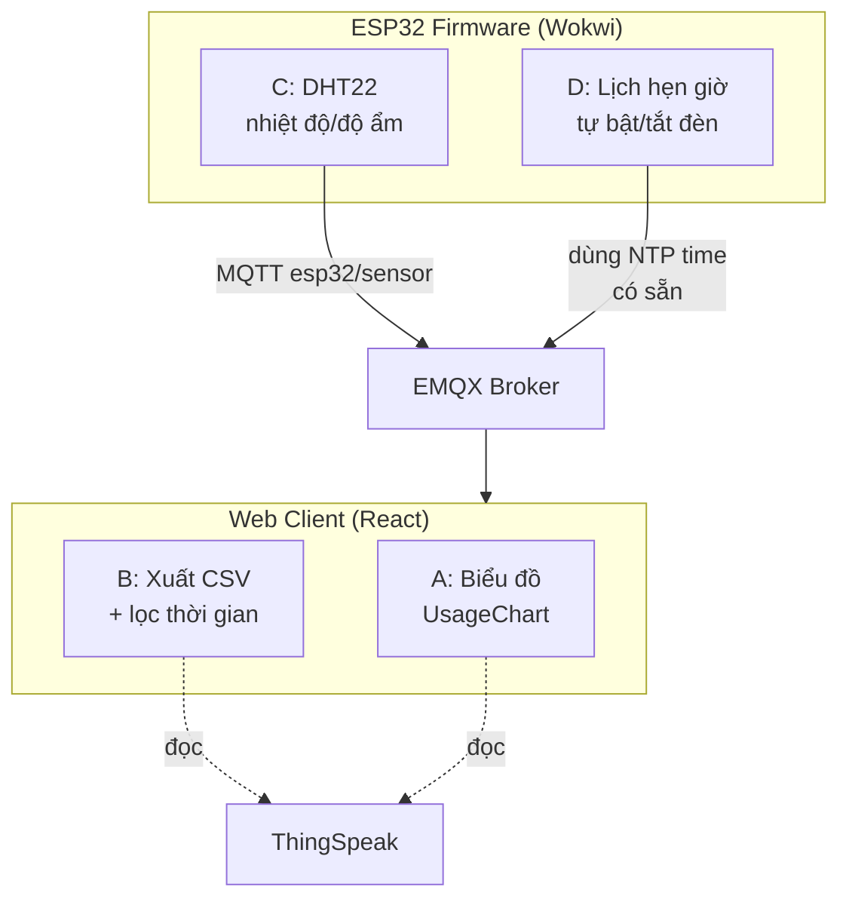

# Phân công tính năng mới — Nhóm 4 người

> Mỗi thành viên phát triển **1 tính năng độc lập** để có phần đóng góp riêng cho báo cáo.
> Các tính năng được chia sao cho **không ai sửa chung file với người khác** → tránh xung đột git.

---

## 1. Bảng phân công

| Người | Mảng | Tính năng | File hướng dẫn | File chính sẽ sửa/tạo |
|---|---|---|---|---|
| **A** | Web-client | Biểu đồ thống kê sử dụng đèn | [01-web-charts.md](01-web-charts.md) | `components/UsageChart.jsx` (mới) + `ActivityLog.jsx` (1 dòng import) |
| **B** | Web-client | Xuất CSV + lọc khoảng thời gian | [02-web-export.md](02-web-export.md) | `utils/export.js` (mới) + `components/ExportBar.jsx` (mới) |
| **C** | Firmware/Wokwi | Cảm biến nhiệt độ – độ ẩm DHT22 | [03-firmware-dht22.md](03-firmware-dht22.md) | `diagram.json` + `main.cpp` (vùng riêng) |
| **D** | Firmware/Wokwi | Lịch hẹn giờ tự bật/tắt đèn | [04-firmware-schedule.md](04-firmware-schedule.md) | `main.cpp` (vùng riêng) |

> **Lưu ý về Wokwi (C & D):** cả 2 cùng sửa `main.cpp`, nên đã chia **vùng code riêng biệt** trong mỗi file hướng dẫn (C thêm phần cảm biến, D thêm phần scheduler — không đè lên nhau). Xem kỹ mục "Ranh giới code" trong từng file. Nên gộp code của C và D vào cuối, do 1 người merge.

---

## 2. Sơ đồ tổng các tính năng trong hệ thống



---

## 3. Quy trình Git — bắt buộc đọc trước khi bắt đầu

Repo: `https://github.com/lvthe/iot_smart_lights`

### 3.1 Chuẩn bị (1 lần)

```bash
git clone https://github.com/lvthe/iot_smart_lights.git
cd iot_smart_lights
```

Sau đó copy file credentials (không có sẵn trên git vì đã gitignore):

```bash
# Web client
cd web-client
cp .env.example .env      # rồi điền thông tin EMQX/ThingSpeak thật
npm install

# Firmware
cd ../wokwi/include
cp secrets.h.example secrets.h   # rồi điền credentials thật
```

### 3.2 Mỗi người làm trên nhánh riêng

```bash
# Trước khi bắt đầu, luôn cập nhật code mới nhất:
git checkout master
git pull

# Tạo nhánh riêng theo tên tính năng của bạn:
git checkout -b feature/web-charts       # người A
git checkout -b feature/web-export       # người B
git checkout -b feature/dht22            # người C
git checkout -b feature/schedule         # người D
```

### 3.3 Trong lúc làm

```bash
git add <file bạn sửa>
git commit -m "feat: mô tả ngắn việc vừa làm"
git push -u origin feature/<tên-nhánh-của-bạn>
```

### 3.4 Khi xong → tạo Pull Request

Lên GitHub, tạo Pull Request từ nhánh của bạn vào `master`. Nhóm review rồi merge. **Không push thẳng vào `master`.**

### 3.5 Nguyên tắc tránh xung đột

- ✅ Chỉ sửa các file được ghi trong file hướng dẫn của **bạn**
- ✅ Ưu tiên **tạo file mới** thay vì sửa file chung (đã thiết kế sẵn như vậy cho A & B)
- ⚠️ Nếu buộc phải sửa file chung (VD C & D cùng sửa `main.cpp`), báo nhau trước và chỉ sửa đúng vùng của mình
- ⚠️ Không commit file `.env`, `secrets.h`, thư mục `node_modules/`, `dist/`, `.pio/` (đã được gitignore sẵn — đừng dùng `git add -f` để ép thêm)

---

## 4. Checklist chung cho mỗi người (dùng khi viết báo cáo)

Mỗi tính năng nên trình bày được các mục sau:

- [ ] **Mục tiêu**: tính năng giải quyết vấn đề gì cho người dùng
- [ ] **Thiết kế**: sơ đồ luồng dữ liệu / linh kiện thêm vào
- [ ] **Code**: các file đã sửa/tạo, giải thích đoạn code quan trọng nhất
- [ ] **Kết quả chạy thật**: screenshot (web) hoặc log Serial + ảnh mạch (Wokwi)
- [ ] **Khó khăn gặp phải & cách xử lý**: phần này giám khảo đánh giá cao
- [ ] **Hướng phát triển tiếp**

---

## 5. Tiêu chí "hoàn thành" (Definition of Done)

Trước khi tạo Pull Request, đảm bảo:

**Web-client (A, B):**
```bash
cd web-client
npm run lint        # không thêm lỗi mới
npm run test:run    # 81 test cũ vẫn phải xanh (không được làm hỏng test có sẵn)
npm run dev         # tự kiểm tra tính năng chạy đúng trên trình duyệt
```

**Firmware (C, D):**
- Build thành công bằng PlatformIO (`Ctrl+Alt+B` → `[SUCCESS]`)
- Chạy simulation Wokwi, xem log Serial xác nhận tính năng hoạt động
- Không làm hỏng các tính năng cũ (đèn vẫn bật/tắt/đổi màu, PIR vẫn chạy)

---

*Xem chi tiết từng tính năng trong các file `01-` đến `04-` cùng thư mục.*
