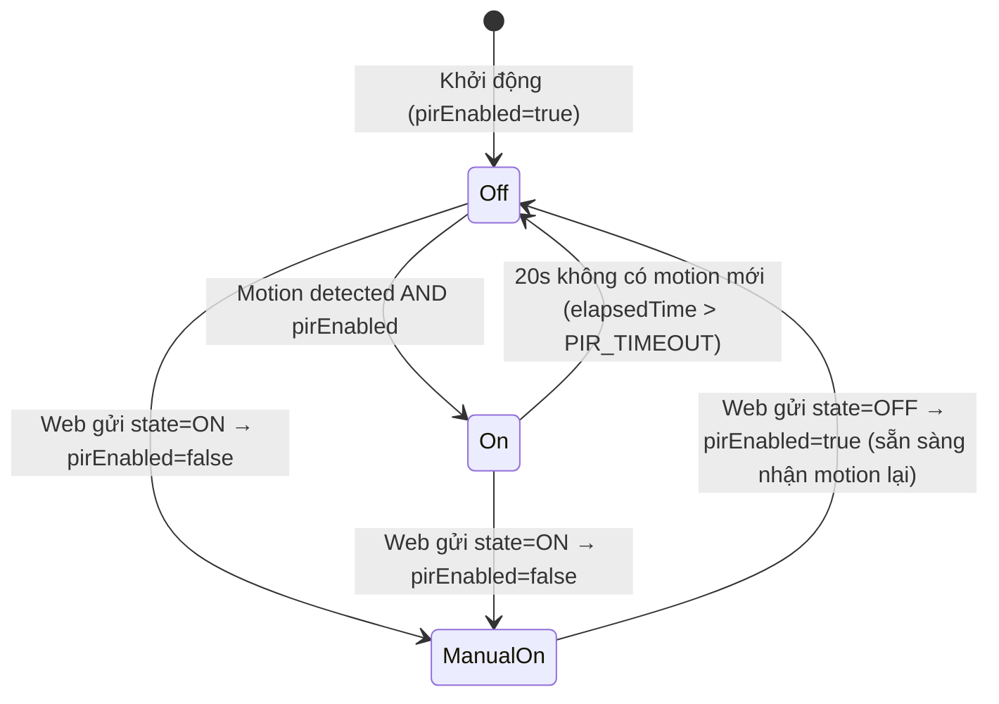

# Phân tích chi tiết — Firmware ESP32 & Mô phỏng Wokwi

> Tài liệu phân tích phần **Wokwi/Firmware ESP32** của dự án IoT Smart Lights.
> Đối tượng: báo cáo môn học — phân tích kiến trúc phần cứng, phần mềm, giao thức giao tiếp, và đánh giá chất lượng code thực tế.
>
> File liên quan: [`src/main.cpp`](src/main.cpp) · [`platformio.ini`](platformio.ini) · [`diagram.json`](diagram.json) · [`wokwi.toml`](wokwi.toml)

---

## 1. Tổng quan vai trò của phần Wokwi trong hệ thống

Phần `wokwi/` chịu trách nhiệm cho **1 trong 3 mắt xích** của hệ thống IoT Smart Lights:


Firmware ESP32 là phần **duy nhất** trực tiếp điều khiển phần cứng (LED, PIR) và là **nguồn sự thật (single source of truth)** cho trạng thái vật lý của cả 6 bóng đèn — web client chỉ là giao diện hiển thị/gửi lệnh, không tự quyết định trạng thái đèn.

---

## 2. Cấu trúc thư mục và vai trò từng file

| File/Thư mục | Vai trò |
|---|---|
| `src/main.cpp` | Toàn bộ logic firmware (709 dòng) — điểm phân tích chính của tài liệu này |
| `include/secrets.h` | Credentials thật (MQTT, ThingSpeak) — **gitignored**, không commit |
| `include/secrets.h.example` | Template credentials để người khác tự điền |
| `platformio.ini` | Khai báo board, framework, thư viện (`lib_deps`), build flags |
| `wokwi.toml` | Trỏ đường dẫn firmware `.bin`/`.elf` cho Wokwi simulator đọc |
| `diagram.json` | Sơ đồ mạch điện (linh kiện + dây nối) cho Wokwi simulator |
| `libraries.txt` | Danh sách thư viện cần cài (bản đúng, khớp `platformio.ini`) |
| `Library_Manager.txt` | ⚠️ Danh sách thư viện — **không khớp thực tế** (xem mục 10.3) |
| `lib/`, `test/` | Trống — chưa dùng đến (chuẩn PlatformIO project layout) |
| `README_WOKWI.md` | Hướng dẫn build/run bằng PlatformIO + bảng pin mapping |

---

## 3. Kiến trúc phần cứng (Hardware)

### 3.1 Danh sách linh kiện (theo `diagram.json`)

| Linh kiện | Loại Wokwi | Số lượng |
|---|---|---|
| ESP32 DevKit-C v4 | `board-esp32-devkit-c-v4` | 1 |
| RGB LED (Common Cathode) | `wokwi-rgb-led` | 5 |
| LED đơn màu trắng | `wokwi-led` | 1 |
| PIR Motion Sensor | `wokwi-pir-motion-sensor` | 1 |
| Điện trở 220Ω | `wokwi-resistor` | 16 (3×5 RGB + 1 LED đơn) |

### 3.2 Công dụng của từng linh kiện

**ESP32 DevKit-C v4** — Bộ vi điều khiển trung tâm, "bộ não" của toàn hệ thống. Nhiệm vụ:
- Kết nối WiFi để giao tiếp mạng (broker MQTT ở xa qua Internet, ThingSpeak qua HTTP)
- Chạy toàn bộ logic điều khiển (`main.cpp`): nhận lệnh, xử lý PIR, lái PWM ra LED
- Có nhiều chân GPIO hỗ trợ PWM (LEDC) — cần thiết để điều chỉnh độ sáng LED, không chỉ bật/tắt on-off
- Có đủ RAM/CPU để chạy đồng thời: TCP/TLS stack (MQTT), JSON parser, và vòng lặp điều khiển thời gian thực — phù hợp hơn nhiều so với vi điều khiển 8-bit đơn giản (VD Arduino Uno) cho một hệ thống có kết nối Internet

**RGB LED (Common Cathode) — 5 cái** — Bóng đèn thật của 5 vị trí cần đổi màu (đèn trùm, đèn TV, đèn đầu giường, đèn bàn làm việc, đèn bếp). Mỗi LED có 3 chip màu Đỏ/Lục/Lam độc lập bên trong 1 vỏ:
- Trộn 3 màu gốc theo tỷ lệ cường độ khác nhau (PWM) để tạo ra các tông màu trung gian (VD trắng ấm, vàng ấm) thay vì chỉ có 1 màu cố định
- Kiểu **Common Cathode** (cực âm chung) được chọn vì hợp với cách ESP32 xuất tín hiệu PWM dương (`analogWrite` cho ra điện áp cao = sáng) — nếu dùng Common Anode sẽ phải đảo ngược logic điều khiển

**LED đơn màu trắng — 1 cái (phòng tắm)** — Bóng đèn cho vị trí duy nhất *không* cần đổi màu. Dùng loại đơn giản hơn (1 chân tín hiệu thay vì 3) vì:
- Phòng tắm không có yêu cầu "3 tông màu nhiệt độ" như các phòng khác trong đặc tả tính năng
- Giảm số GPIO cần dùng (tiết kiệm 2 chân so với dùng RGB) — hợp lý khi tính năng chính của đèn này là phối hợp với PIR, không phải đổi màu

**PIR Motion Sensor — 1 cái (phòng tắm)** — Cảm biến hồng ngoại thụ động, phát hiện chuyển động bằng cách đo sự thay đổi bức xạ nhiệt hồng ngoại trong vùng quan sát. Vai trò:
- Cho phép đèn phòng tắm **tự động bật** khi có người bước vào mà không cần thao tác tay — tiện lợi và tiết kiệm điện (không quên tắt đèn)
- Xuất tín hiệu số (digital HIGH/LOW) qua chân `OUT`, rất dễ đọc bằng `digitalRead()` — không cần ADC hay xử lý tín hiệu tương tự phức tạp
- Chỉ lắp cho phòng tắm (không lắp cả 6 phòng) vì đây là tính năng đặc thù được đặc tả riêng cho phòng tắm trong yêu cầu hệ thống

**Điện trở 220Ω — 16 cái (3 cho mỗi RGB LED + 1 cho LED đơn)** — Điện trở giới hạn dòng điện (current-limiting resistor), linh kiện bảo vệ bắt buộc khi dùng LED:
- LED là linh kiện bán dẫn, nếu cấp thẳng điện áp GPIO (3.3V) mà không qua điện trở, dòng điện sẽ tăng vọt không kiểm soát → cháy LED hoặc hỏng chân GPIO của ESP32
- 220Ω là giá trị phổ biến, cân bằng giữa việc giới hạn dòng đủ an toàn (~10-15mA mỗi kênh màu ở áp 3.3V) mà LED vẫn đủ sáng để quan sát rõ trong mô phỏng
- Mỗi kênh màu (R/G/B) của RGB LED cần 1 điện trở riêng vì mỗi kênh là 1 chip LED độc lập với dòng điện riêng — không thể dùng chung 1 điện trở cho cả 3 kênh

### 3.3 Bảng GPIO pin mapping

| Đèn | `light_id` | Loại | R | G | B | Ghi chú |
|---|---|---|---|---|---|---|
| Đèn trùm phòng khách | `living_main` | RGB | GPIO 25 | GPIO 13 | GPIO 26 | RGB1 |
| Đèn TV | `living_tv` | RGB | GPIO 4 | GPIO 17 | GPIO 16 | RGB2 |
| Đèn đầu giường | `bedroom_headboard` | RGB | GPIO 23 | GPIO 22 | GPIO 21 | RGB3 |
| Đèn bàn làm việc | `bedroom_desk` | RGB | GPIO 19 | GPIO 18 | GPIO 5 | RGB4 |
| Đèn nhà bếp | `kitchen` | RGB | GPIO 27 | GPIO 32 | GPIO 14 | RGB5 |
| Đèn phòng tắm | `bathroom` | LED đơn | — | — | GPIO 33 | 1 chân tín hiệu |
| PIR (phòng tắm) | — | Input | — | — | GPIO 35 | **Input-only pin** |

**Điểm thiết kế đáng chú ý:** GPIO 35 được chọn cho PIR vì đây là 1 trong số ít chân **input-only** của ESP32 (không có driver output, không dùng được `pinMode(OUTPUT)`) — lựa chọn đúng vì PIR chỉ cần đọc, không cần ghi.

### 3.4 Sơ đồ đấu nối (rút gọn)

```
ESP32 DevKit-C v4
├── 5× RGB LED (Common Cathode)
│    mỗi kênh R/G/B: GPIO ──[220Ω]── LED pin
│    chân COM (cathode chung) ── GND
├── 1× LED đơn (Bathroom): GPIO 33 ──[220Ω]── LED ── GND
└── PIR Motion Sensor (Bathroom)
     VCC → 3V3   |   GND → GND   |   OUT → GPIO 35
```

**Common Cathode** được chọn cho RGB LED — nghĩa là chân chung nối GND, và mỗi màu (R/G/B) được **BẬT khi đưa điện áp cao (PWM lớn)** vào chân tương ứng. Điều này khớp với code: `analogWrite(pin, giá_trị_pwm)` — giá trị PWM lớn → sáng, `0` → tắt.

---

## 4. Kiến trúc phần mềm (Software)

### 4.1 Vòng đời chương trình

```mermaid
sequenceDiagram
    participant Setup as setup()
    participant Loop as loop()
    Setup->>Setup: Config GPIO (pinMode)
    Setup->>Setup: updateAllLEDs() - đặt LED về trạng thái mặc định
    Setup->>Setup: setupWiFi() - kết nối Wokwi-GUEST (blocking)
    Setup->>Setup: setupMQTT() - kết nối EMQX + subscribe + publish status ban đầu
    Setup->>Setup: ThingSpeak.begin()
    Setup->>Loop: Setup complete!
    loop mỗi 100ms
        Loop->>Loop: Kiểm tra & reconnect MQTT nếu mất kết nối
        Loop->>Loop: mqtt.loop() - xử lý gói tin inbound
        Loop->>Loop: Xử lý "deferred publish" đang chờ (nếu có)
        Loop->>Loop: Đọc PIR, xử lý auto ON/OFF cho bathroom
        Loop->>Loop: Nếu đủ 30s → publishAllStatus()
        Loop->>Loop: Nếu đủ 60s → kiểm tra & upload ThingSpeak nếu có thay đổi
    end
```

### 4.2 Cấu trúc dữ liệu trung tâm

```cpp
struct RGBState {
  bool power;          // ON/OFF
  uint8_t colorIndex;  // index vào COLOR_PALETTE
  uint8_t brightness;  // 0..100 (%)
};

RGBState rgbStates[6];       // trạng thái hiện tại của 6 đèn
RGBState lastRgbStates[6];   // trạng thái ở lần check ThingSpeak trước (để so sánh thay đổi)
```

Đây là **mảng 6 phần tử duy nhất** làm "nguồn sự thật" cho toàn bộ hệ thống — mọi thay đổi (từ MQTT lệnh, từ PIR) đều ghi vào `rgbStates[]`, sau đó `updateRGBLED()` đọc từ đây ra để lái PWM thực tế, và `publishStatus()` đọc từ đây để gửi lên MQTT. Thiết kế này tránh được tình trạng "nhiều nơi giữ state khác nhau, dễ lệch nhau" — một nguyên tắc thiết kế tốt.

Việc mã hoá phòng bằng **index số (0-5)** thay vì so sánh string liên tục giúp code nhẹ hơn cho vi điều khiển (so sánh int nhanh hơn `strcmp`), đổi lại phải tra `getRoomIndexById()` một lần duy nhất mỗi khi có lệnh MQTT đến.

---

## 5. Giao tiếp MQTT — điểm kỹ thuật quan trọng nhất

### 5.1 Kiến trúc "1 kết nối duy nhất"

Thay vì tạo nhiều topic riêng cho từng đèn (`esp32/living_main/control`, `esp32/kitchen/control`, ...), hệ thống dùng **đúng 2 topic chung**:

| Topic | Hướng | Vai trò |
|---|---|---|
| `esp32/control` | Web → ESP32 (ESP32 subscribe) | Web gửi lệnh điều khiển |
| `esp32/status` | ESP32 → Web (ESP32 publish) | ESP32 báo trạng thái |

Đèn nào được điều khiển/báo cáo được xác định bằng trường **`light_id` nằm trong JSON body**, không phải bằng topic. Đây là lựa chọn kiến trúc hợp lý cho quy mô nhỏ (6 đèn): giảm số lượng subscription, đơn giản hoá logic broker ACL (chỉ cần cấp quyền 2 topic thay vì 12), đánh đổi lại là ESP32 phải tự parse `light_id` và tra bảng bằng vòng lặp `strcmp` (chấp nhận được vì chỉ có 6 phần tử).

### 5.2 Định dạng message (JSON qua ArduinoJson v7)

**Control (Web → ESP32):**
```json
{ "light_id": "living_main", "state": "ON", "brightness": 80, "colorId": "cold_white" }
```

**Status (ESP32 → Web):**
```json
{
  "light_id": "living_main", "state": "ON", "brightness": 80,
  "colorId": "cold_white", "color": { "r": 255, "g": 255, "b": 255 }
}
```

Đèn phòng tắm (LED đơn) không có `colorId`/`color` trong status — code có kiểm tra `if (roomIndex != BATHROOM_INDEX)` trước khi thêm field màu, tránh gửi dữ liệu vô nghĩa.

### 5.3 Cơ chế "Deferred Publish" — chống crash reentrancy

Đây là chi tiết kỹ thuật đáng phân tích sâu nhất trong toàn bộ firmware.

**Vấn đề:** Thư viện `PubSubClient` gọi hàm `callback()` ngay trong quá trình xử lý gói tin MQTT nhận vào (bên trong `mqtt.loop()`). Nếu gọi `mqtt.publish()` **ngay trong `callback()`**, có nguy cơ **reentrancy** — gọi lồng vào chính hàm đang xử lý buffer mạng, dễ gây treo/crash trên vi điều khiển (buffer TCP chưa giải phóng xong).

**Giải pháp trong code:**
```cpp
// Trong callback(): CHỈ set flag, KHÔNG publish
pendingStatusPublish[roomIndex] = true;
pendingStatusTime[roomIndex] = millis();

// Trong loop(): publish thực sự, sau khi đã đợi PUBLISH_DELAY_MS = 100ms
for (int i = 0; i < 6; i++) {
  if (pendingStatusPublish[i] && millis() - pendingStatusTime[i] >= PUBLISH_DELAY_MS) {
    pendingStatusPublish[i] = false;
    publishStatus(i);
  }
}
```

Đây là một **pattern kỹ thuật đúng và phổ biến trong embedded MQTT** (tách "nhận lệnh" và "gửi phản hồi" ra 2 pha khác nhau bằng flag + polling trong `loop()`), thể hiện người viết code đã gặp và xử lý một lớp bug thực tế của `PubSubClient`, không chỉ code theo lý thuyết.

### 5.4 Bảo mật kết nối (TLS)

```cpp
espClient.setInsecure(); // bỏ qua kiểm tra chứng chỉ server
```

`setInsecure()` vẫn **mã hoá đường truyền** (chống nghe trộm bị động) nhưng **không xác thực danh tính broker**, nên vẫn có thể bị tấn công man-in-the-middle chủ động. Đây là lựa chọn **chấp nhận được cho môi trường demo/mô phỏng Wokwi** (không có cách nào dễ dàng để nạp root CA cert vào ESP32 ảo), nhưng **không nên dùng nếu triển khai lên phần cứng thật** — khi đó cần `espClient.setCACert(...)` với chứng chỉ gốc của EMQX.

### 5.5 Timeout & Reconnect

| Thông số | Giá trị | Ý nghĩa |
|---|---|---|
| `WIFI_CONNECT_TIMEOUT_MS` | 30s | Quá thời gian này chưa nối được WiFi → `ESP.restart()` |
| `MQTT_CONNECT_TIMEOUT_MS` | 30s | Quá thời gian này chưa nối được MQTT → `ESP.restart()` |
| `MQTT_RETRY_DELAY_MS` | 5s | Nghỉ giữa 2 lần thử reconnect MQTT (tránh bị EMQX rate-limit) |
| `STATUS_BROADCAST_INTERVAL` | 30s | Chu kỳ gửi lại status toàn bộ 6 đèn (giúp web đồng bộ lại nếu bị mất gói) |
| `mqtt.setKeepAlive()` | 60s | Ping broker để giữ kết nối |
| `mqtt.setBufferSize()` | 512 bytes | Tăng từ default 256B — đủ chứa JSON status có màu (~150 bytes) an toàn |

**⚠️ Hạn chế đáng lưu ý:** `setupMQTT()` dùng `while (!mqtt.connected())` với `delay()` bên trong — đây là **vòng lặp blocking**. Khi mất kết nối MQTT, `loop()` sẽ bị "đứng" tại `setupMQTT()` cho đến khi kết nối lại được — nghĩa là **PIR sẽ không được đọc/xử lý trong lúc đang reconnect MQTT** (dù thời gian này thường ngắn). Với quy mô demo hiện tại việc này không nghiêm trọng, nhưng là điểm cần cân nhắc nếu mở rộng hệ thống.

---

## 6. Xử lý màu sắc & độ sáng (PWM)

### 6.1 Bảng màu (Color Palette) — ESP32 là nguồn sự thật

```cpp
const ColorDef COLOR_PALETTE[] = {
    {"cold_white", 255, 255, 255}, // Trắng Lạnh
    {"warm_white", 255, 190, 120}, // Trắng Ấm
    {"warm_yellow", 255, 170, 0}   // Vàng Ấm
};
```

Web client gửi `colorId` (string), ESP32 tra bảng này ra giá trị RGB thật để lái LED — và trả **cả `colorId` và `{r,g,b}`** trong status để web không cần tự tra bảng lại. Bảng màu 3 phần tử này phải **khớp tuyệt đối** với `COLOR_ARRAY` trong [`web-client/src/utils/constants.js`](../web-client/src/utils/constants.js) — đây là một "hợp đồng ngầm" giữa 2 codebase, không có cơ chế tự động kiểm tra đồng bộ (rủi ro nếu 1 bên đổi mà quên đổi bên kia).

### 6.2 Công thức tính PWM

```cpp
uint8_t brightness = map(rgbStates[i].brightness, 0, 100, 0, 255); // % -> 0-255
analogWrite(pinR, (c.r * brightness) / 255);  // scale màu theo độ sáng
analogWrite(pinG, (c.g * brightness) / 255);
analogWrite(pinB, (c.b * brightness) / 255);
```

Độ sáng (%) được nhân vào từng kênh màu theo tỷ lệ — ví dụ màu Vàng Ấm `(255,170,0)` ở độ sáng 50% sẽ ra `(127,85,0)`, giữ đúng tỉ lệ màu, chỉ giảm cường độ tổng thể (đúng nguyên lý PWM dimming cho LED).

### 6.3 Fix riêng cho Wokwi: `analogWrite(0)` thay vì `digitalWrite(LOW)`

```cpp
// ⚠️ FIX WOKWI: Dùng analogWrite(0) thay vì digitalWrite(LOW)
// vì trên ESP32 digitalWrite không tắt được kênh PWM đã kích hoạt
analogWrite(pinsR[roomIndex], 0);
```

Đây là một bug thực tế của core Arduino-ESP32: khi 1 chân đã từng được cấu hình chạy PWM (LEDC channel) bằng `analogWrite()`, gọi `digitalWrite(LOW)` sau đó **không tắt được kênh PWM đang chạy** (chân vẫn giữ duty-cycle cũ). Cách khắc phục đúng là tiếp tục dùng `analogWrite(pin, 0)` để đặt duty-cycle về 0. Đây là chi tiết cho thấy code đã được test thực tế trên Wokwi và sửa theo hành vi quan sát được, không chỉ viết theo tài liệu lý thuyết.

---

## 7. Logic cảm biến chuyển động PIR (State Machine)

### 7.1 State diagram



### 7.2 Quy tắc tương tác giữa điều khiển thủ công và tự động (`handleCommand`)

```cpp
if (roomIndex == BATHROOM_INDEX && doc.containsKey("state")) {
  if (state == "ON")  pirEnabled = false;  // Web bật tay -> tắt auto mode
  else                 pirEnabled = true;   // Web tắt tay -> mở lại auto mode
}
```

Đây là thiết kế UX hợp lý: nếu người dùng **chủ động bật đèn qua web**, hệ thống hiểu là họ muốn đèn sáng liên tục (VD: dọn phòng tắm lâu, không muốn đèn tự tắt) → tạm khoá PIR. Khi họ **tắt tay**, hệ thống coi như "trả quyền" lại cho PIR để sẵn sàng tự động bật lần sau có người vào.

### 7.3 Cơ chế đếm ngược & tắt tự động

```cpp
if (motionDetected != lastMotionState) {      // chỉ xử lý ở CẠNH lên/xuống
  lastMotionState = motionDetected;
  if (motionDetected) lastMotionTime = millis(); // reset đồng hồ mỗi lần có motion mới
}

if (pirEnabled && rgbStates[BATHROOM_INDEX].power) {
  if (millis() - lastMotionTime > PIR_TIMEOUT) {  // luôn kiểm tra, không phụ thuộc trạng thái hiện tại của PIR
    setPower(BATHROOM_INDEX, false);
  }
}
```

**Ghi chú kỹ thuật đáng phân tích trong báo cáo:** `lastMotionTime` chỉ được cập nhật khi có **cạnh lên** (chuyển từ không-motion sang có-motion), không phải mỗi khi `PIR_PIN` đang ở mức HIGH liên tục. Với PIR vật lý thật, hành vi này phụ thuộc loại module: nếu PIR ở chế độ "retriggerable" (tự tạo nhiều cạnh lên/xuống khi còn chuyển động liên tục) → đồng hồ được reset liên tục, hoạt động đúng như mong đợi. Nếu module PIR (hoặc cấu hình delay-time) giữ mức HIGH liên tục suốt một khoảng chuyển động dài mà không tạo cạnh lên mới, đèn có thể tự tắt sau 20s dù người vẫn còn trong phòng. Đây là điểm nên nêu trong phần "hạn chế" của báo cáo vì thể hiện hiểu sâu về hành vi phần cứng thay vì chỉ đọc code trên mặt chữ.

---

## 8. Tích hợp ThingSpeak

### 8.1 Field mapping

| Field | Đèn | Giá trị |
|---|---|---|
| field1 | `living_main` | 0 = OFF, 1 = ON |
| field2 | `living_tv` | 0 = OFF, 1 = ON |
| field3 | `bedroom_headboard` | 0 = OFF, 1 = ON |
| field4 | `bedroom_desk` | 0 = OFF, 1 = ON |
| field5 | `kitchen` | 0 = OFF, 1 = ON |
| field6 | `bathroom` | 0 = OFF, 1 = ON |

### 8.2 Giải thuật tránh spam upload

```cpp
bool hasThingSpeakStateChanged(int i) {
  return (rgbStates[i].power != lastRgbStates[i].power);
}
// ... trong loop(), mỗi 60s:
bool anyChanged = false;
for (int i = 0; i < 6; i++) {
  if (hasThingSpeakStateChanged(i)) { anyChanged = true; updateLastState(i); }
}
if (anyChanged) uploadToThingSpeak();
```

Thay vì upload mù mỗi 60 giây (tốn quota API — ThingSpeak free tier giới hạn request/phút), code **chỉ upload khi có ít nhất 1 đèn đổi state ON/OFF** so với lần kiểm tra trước. Vì `ThingSpeak.writeFields()` gửi **cả 6 field cùng lúc trong 1 request** (không phải 6 request riêng), cách này vừa tiết kiệm quota vừa đơn giản hoá logic — đánh đổi là **brightness/color thay đổi không được ghi vào ThingSpeak**, chỉ theo dõi được thời gian ON/OFF (điều này khớp đúng với mục tiêu ban đầu: "thống kê thời gian sử dụng đèn", không phải log toàn bộ lịch sử màu sắc).

---

## 9. Hệ thống Logging & đồng bộ thời gian

```cpp
String nowStamp() {
  time_t now = time(nullptr);
  if (now < 100000) { // NTP chưa sync xong -> dùng uptime từ lúc boot
    unsigned long s = millis() / 1000;
    sprintf(buf, "[%02lu:%02lu:%02lu]", ...);
  } else {
    // NTP đã sync -> giờ thực UTC+7
  }
}
```

Cơ chế fallback 2 tầng: mọi dòng log đều có tiền tố `[hh:mm:ss]`, ưu tiên giờ thực lấy từ NTP (`pool.ntp.org`, `time.nist.gov`), nhưng nếu NTP chưa kịp đồng bộ (những giây đầu sau khi boot) thì tự chuyển sang hiển thị uptime tính từ lúc khởi động — đảm bảo log luôn có timestamp hữu ích, không bao giờ hiện giá trị rác (VD: ngày 1/1/1970).

---

## 10. Quản lý cấu hình, bảo mật & các điểm không đồng bộ phát hiện được

### 10.1 Tách credentials khỏi source code

Ban đầu `MQTT_PASSWORD`, `THINGSPEAK_WRITE_API_KEY` được **hardcode trực tiếp** trong `main.cpp`. Đã refactor sang `include/secrets.h` (gitignored) + `secrets.h.example` (template) — theo đúng pattern `.env`/`.env.example` mà web-client đã dùng. Đây là thực hành bảo mật cơ bản: **source code có thể public, credentials không bao giờ được commit**.

### 10.2 Đồng bộ tài liệu vs code thực tế

| Nội dung | README.md (trước khi sửa) | `main.cpp` (thực tế) |
|---|---|---|
| PIR auto-off timeout | ghi "30 giây" | `PIR_TIMEOUT = 20000` → 20 giây |

→ Đã sửa README khớp với code (code luôn là nguồn sự thật vì đó là hành vi thực chạy).

### 10.3 `Library_Manager.txt` không khớp thực tế

File này liệt kê: `PubSubClient`, `ArduinoJson`, **`FastLED`** — nhưng `platformio.ini` thực tế dùng `PubSubClient`, `ArduinoJson`, **`ThingSpeak`** (không có FastLED, code cũng không `#include <FastLED.h>` ở đâu cả). File `libraries.txt` mới hơn thì đúng. Đây là dấu hiệu `Library_Manager.txt` là tài liệu **để lại từ một phiên bản thiết kế cũ** (có thể ban đầu định dùng FastLED để điều khiển LED dải WS2812B, sau đổi hướng sang RGB LED rời điều khiển bằng PWM thường + ThingSpeak để log). Nên cân nhắc xoá hoặc cập nhật file này để tránh gây nhầm lẫn cho người đọc sau.

### 10.4 `lib/` và `test/` trống

Là cấu trúc chuẩn PlatformIO tạo sẵn, hiện chưa được sử dụng (không có unit test C++ nào cho firmware, khác với `web-client` đã có 81 test Vitest). Đây là điểm có thể ghi vào phần "hạn chế/hướng phát triển" của báo cáo.

---

## 11. Cấu hình build (PlatformIO)

```ini
[env:wokwi]
platform = espressif32
board = esp32dev
framework = arduino
build_flags =
    -DCORE_DEBUG_LEVEL=3      ; mức log debug chi tiết cho core ESP32
    -DBOARD_HAS_PSRAM         ; bật PSRAM (DevKit-C v4 có sẵn)
    -DWOKWI_SIMULATION        ; flag riêng để phân biệt build cho simulator
lib_deps =
    bblanchon/ArduinoJson@^7.2.2
    knolleary/PubSubClient@^2.8
    mathworks/ThingSpeak@^2.1.1
```

`wokwi.toml` chỉ đơn giản trỏ Wokwi simulator đến file `.pio/build/wokwi/firmware.bin`/`.elf` — nghĩa là **Wokwi không tự compile code**, nó chỉ nạp file `.bin` đã được PlatformIO build sẵn. Đây là lý do quan trọng cần nhớ khi vận hành: **phải build lại bằng PlatformIO trước mỗi lần chạy simulation** nếu có sửa code, nếu không simulator sẽ chạy firmware cũ (đã được ghi rõ trong `README_WOKWI.md`).

---

## 12. Kết quả kiểm thử thực tế (Verification Log)

Đã build và chạy simulation thực tế trên Wokwi, kết nối tới EMQX broker thật (không phải mock), log Serial thu được:

```
[00:00:00] WIFI CONNECTED: SSID=Wokwi-GUEST IP=10.13.37.2
[00:00:02] [MQTT] CONNECTED: b280221b.ala.asia-southeast1.emqxsl.com:8883
[00:00:06] [MQTT] Subscribed to esp32/control
[00:00:06] [MQTT] >>>>>>>>>> STATUS BROADCAST: Publishing all 6 lights status... <<<<<<<<<<
[00:00:06] [MQTT] Transmit: Đèn trùm -> esp32/status {"light_id":"living_main","state":"OFF","brightness":100,"colorId":"cold_white","color":{"r":255,"g":255,"b":255}}
... (5 đèn còn lại tương tự)
[00:00:06] ThingSpeak initialized
[00:00:06] Setup complete!
```

Đồng thời xác nhận từ phía Web Client (đang chạy `npm run dev` song song) đã **nhận đúng cả 6 message status** qua MQTT thật, UI chuyển từ "0/6 đã kết nối" → **"6/6 đã kết nối"**. Điều này xác nhận toàn bộ chuỗi end-to-end (ESP32 firmware ⇄ EMQX Cloud ⇄ Web Client) hoạt động đúng như thiết kế trên môi trường thật, không chỉ đúng về logic code.

---

## 13. Tổng kết đánh giá

### Điểm mạnh
- Kiến trúc "1 kết nối, phân biệt bằng `light_id`" phù hợp quy mô 6 đèn, giảm độ phức tạp ACL trên broker
- Xử lý đúng bug reentrancy của `PubSubClient` bằng deferred-publish pattern — thể hiện đã test thực tế, không chỉ code lý thuyết
- Tách bạch rõ state (`rgbStates[]`) — nguồn sự thật duy nhất — với việc lái phần cứng (`updateRGBLED`) và giao tiếp (`publishStatus`)
- Có cơ chế tự phục hồi (`ESP.restart()` khi WiFi/MQTT timeout quá lâu) — tăng độ tin cậy khi chạy dài hạn không người giám sát
- Giải thuật chống spam ThingSpeak (chỉ upload khi đổi state) tiết kiệm quota API hợp lý
- Log có timestamp nhất quán, dễ debug

### Hạn chế / điểm cần lưu ý khi báo cáo
1. `setupMQTT()` block `loop()` khi mất kết nối → PIR tạm ngưng phản hồi trong lúc reconnect
2. `setInsecure()` bỏ qua xác thực chứng chỉ broker — chấp nhận được cho demo, không dùng cho production thật
3. `lastMotionTime` chỉ cập nhật theo cạnh lên của PIR — hành vi phụ thuộc loại module PIR thật khi lên phần cứng
4. Bảng màu (`COLOR_PALETTE`) phải đồng bộ tay với `COLOR_ARRAY` bên web — không có kiểm tra tự động, dễ lệch khi 1 bên sửa mà quên bên kia
5. Chưa có unit test cho firmware (thư mục `test/` còn trống)
6. `Library_Manager.txt` là tài liệu lỗi thời (nhắc tới FastLED không dùng tới) — nên dọn để tránh nhầm lẫn khi báo cáo/nộp bài

---

*Tài liệu này được tạo dựa trên phân tích trực tiếp source code `src/main.cpp`, cấu hình PlatformIO/Wokwi, và log thực tế thu được khi chạy simulation kết nối tới EMQX broker thật.*
